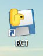

---

## Mục Lục
- [Hình ảnh về RCT](#các-hình-ảnh-về-rct)
- [Hướng dẫn cài đặt và sử dụng](#hướng-dẫn-sử-dụng-phần-mềm)
- [Thông tin về RCT](#về-rct)
## Các hình ảnh về RCT 
  Biểu tượng 

  

  Tab Home
  
  

  Tab Main
  
  

  Tab Setting
  
  
  - **Các chức năng**
    
    **1. Gửi và nhận file ( gửi file từ telegram và lưu vào máy,lấy file từ máy gửi ra telegram )**
       
    
    
    

    **2. Khóa bàn phím ( khóa các phím thường hay dùng và đặt thời gian tự động mở )**
       
    

    **3. Giám sát bàn phím ( giám sát các phím đã nhấn và gửi file kết quả về telegram sau khi hết thời gian giám sát )**
       
    

    **4. Xem tiến trình và dừng ( xem các tiến trình đang chạy và dừng tiến trình nếu cần,giới hạn xem 40 tiến trình )**
       
    
    
    

    **5. Tắt máy ( dùng lệnh để tắt máy tính từ xa )**
        
    
    
    **note : tính năng chụp màn hình khi dùng bot sẽ chụp màn hình hiện tại và gửi ảnh cho người dùng**
---
# Hướng Dẫn Sử Dụng Phần Mềm

## 1. Cài Đặt Phần Mềm

- **Tải file cài đặt:**  
  Tải phiên bản mới nhất từ Releases của dự án : [tại đây](https://github.com/Anhdeface/recote_RCT/releases)

- **Chạy file cài đặt:**  
  Mở file cài đặt và theo dõi các bước trên màn hình.

- **Bỏ qua bước không cần thiết:**  
  Nhấn **Next** khi thấy các bước không quan trọng để tiết kiệm thời gian.

- **Hoàn tất cài đặt:**  
  Nhấn **Finish** sau khi cài đặt xong.

---

## 2. Liên Kết Token Bot Telegram
Xem chi tiết ở đây : [xem bài viết chi tiết](https://vietnix.vn/tao-bot-telegram/)

Để phần mềm hoạt động, cần liên kết token của bot Telegram. Thực hiện theo các bước dưới đây:

### Tạo Bot và Lấy Token

1. **Mở ứng dụng Telegram:**  
   Sử dụng ứng dụng trên điện thoại hoặc máy tính.

2. **Tìm kiếm @BotFather:**  
   Nhập `@BotFather` vào thanh tìm kiếm và mở cuộc trò chuyện với bot chính thức.

3. **Gửi lệnh tạo bot:**  
   Gõ `/newbot` và gửi tin nhắn cho @BotFather.

4. **Đặt tên cho bot:**  
   Nhập tên cho bot theo hướng dẫn.

5. **Chọn username cho bot:**  
   Chọn một username độc đáo (username phải kết thúc bằng “bot”, ví dụ: `examplebot`).

6. **Nhận token:**  
   Sau khi hoàn tất, @BotFather sẽ gửi một chuỗi ký tự là **Token**. Sao chép token này để sử dụng sau.

---

## 3. Nhập Token Vào Phần Mềm

- **Mở phần mềm:**  
  Khởi động phần mềm đã được cài đặt.

- **Truy cập tab Setting:**  
  Chọn tab **Setting** trên giao diện.

- **Nhập token:**  
  Dán token đã sao chép vào ô nhập liệu được chỉ định.

- **Lưu cài đặt:**  
  Nhấn nút **Lưu cài đặt** để lưu lại thông tin token.

---

## 4. Khởi Động Bot

- **Chuyển sang tab Main:**  
  Quay lại giao diện chính, chuyển sang tab **Main**.

- **Kích hoạt bot:**  
  Nhấn nút **Start** để khởi động bot.

- **Kiểm tra hoạt động:**  
  Gửi các lệnh đã được lập trình ( `/help`, `/menu`) để xác nhận bot hoạt động bình thường.

---
## Về RCT

-RCT là phần mềm được thiết kế bởi QuocAnh và YenNgoc được viết hoàn toàn bằng ngôn ngữ Python

-Sử dụng PyInstaller để đóng gói và UPX để tối ưu,NSIS được sử dụng để tạo file cài đặt giúp người dùng dễ dàng cài đặt phần mềm

-Sử dụng phần lớn thư viện telebot (pyTelegramBotAPI) để điều khiển bot và thực hiện các lệnh

-Sử dụng framework PyQt5 và Qt Designer để thiết kế giao diện người dùng 

-Hoàn thành dự án chính thức sau 18 ngày ( kể từ 9/02/2025 - 27/02/2025 )

-Lưu ý : vì phần mềm thực hiện các hành động như : chụp màn hình,khóa bàn phím,giám sát bàn phím...Nên Windows sẽ nhận diện đây là virus

---

